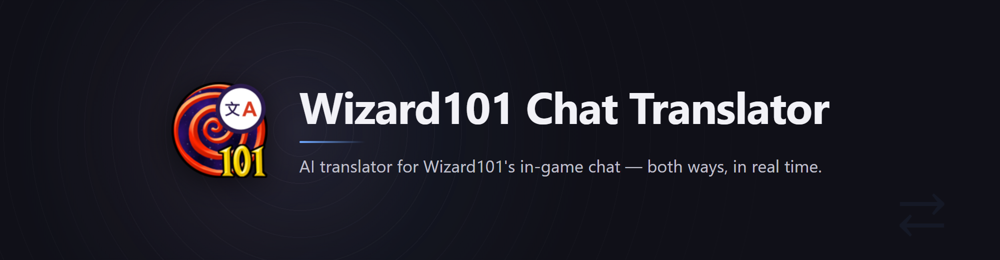

<p align="center">
  
</p>

English | [繁體中文](README_ZH-TW.md) | [简体中文](README_ZH-CN.md)

[](https://github.com/GoneTone/wizard101-chat-translator/actions/workflows/ci.yml)
[](https://github.com/GoneTone/wizard101-chat-translator/releases/latest)

Wizard101 Chat Translator — an AI translator for Wizard101's in-game chat, translating conversations both ways in real time.

**Reading chat**: every line that appears in chat is translated into the language you set and shown in an overlay window, with the original kept above the translation, so you always see what was actually said.

**Speaking**: open the chat input box in the game and the translation input box comes up on its own. Type in any language and press Enter, and the English translation is typed into the game's chat box character by character (the game does not accept pasted text). The translated line is **never sent for you** — you get to check it, then press Enter to send.

The language chat is translated into is up to you: write the language name straight into the settings (`繁體中文（台灣）`, `日本語`, `Español`, …). The language other people write in is detected by the AI automatically.

Chat is read straight out of the game's chat window rather than off the screen: nothing is misread, nothing arrives out of order, everyone's lines are covered — yours included, along with who said them — and no network traffic is touched.

## ⚠ Important

This software injects into the game process to read in-game conversations. KingsIsle does not sanction this, and it may be treated as a breach of the [Wizard101 Terms of Use](https://www.wizard101.com/game/termsofuse); under those terms KingsIsle may suspend an account for any reason, or for no reason. **Use at your own discretion.**

## Download

Download `Wizard101ChatTranslator.exe` and put it in any folder. The settings file `config.json` and the logs `app.log`, `messages.log` are all created next to the exe.

<https://github.com/GoneTone/wizard101-chat-translator/releases/latest>

**Updating**: close the software first — click the ✕ at the top-right of the overlay's title bar — and only then swap the file. While it is running the exe is locked by Windows and it is still hooked into the game. Once it is closed, download the new `Wizard101ChatTranslator.exe` and overwrite the old one in the same folder; your existing `config.json` is used as it is, so the provider, API key and other settings never have to be entered again.

**Anti-virus false positives**: this software reads the game's chat memory (by hooking into the game process) and listens for a global hotkey. That behavior pattern resembles some malware, so anti-virus programs may flag it or delete/quarantine it outright. This is a false positive; assess the risk yourself and add the program to your anti-virus allowlist.

**Administrator privileges**: normally not required (when the game starts with normal privileges). Only when Wizard101 itself runs **as administrator** must this software also run as administrator (hooking into a process requires equal or higher privileges). If privileges are insufficient, the overlay shows an "⚠  insufficient privileges" banner: close the software, right-click it, choose *Run as administrator*, and start it again.

## How to Use

1. Double-click the exe:
   - On the **first launch** (no `config.json` found) a **setup wizard** appears: step 1 picks the UI language, step 2 picks the translation provider, fills in the API key and tests the connection, step 3 picks the target language and the hotkey. Once saved, the main flow starts automatically.
   - Every later launch goes straight to the main flow — no wizard. The UI language can still be changed at any time in the settings window (gear ⚙); saving applies it immediately, with no restart.
2. Start Wizard101 and **log in, all the way into the game world** — only then can the overlay read chat.
3. A chat message appears → the overlay shows **the original plus the translation** in your target language (newest at the bottom, scroll up for history; by default nothing fades away on a timer, but at most 200 messages are kept and the oldest are dropped beyond that).
   - **Movable and resizable**: drag the title bar at the top to move it, drag any edge or corner to resize (there is also a grip in the bottom-right corner; the ⚙ / ─ / ✕ buttons on the title bar stay buttons and do not start a resize). Position and size are saved automatically.
   - **Selectable and copyable**: press and drag the left mouse button over the messages to select text, across several messages if you want; dragging past the top or bottom edge of the message area auto-scrolls, so you can reach content that is off-screen. Then press `Ctrl+C`, or right-click the selection and choose *Copy*. Copied text has **a blank line between messages**.
   - Note: the window is not click-through — clicks on the area it covers do not reach the game.
4. To say something: open the chat input box in the game → the translation input box appears on its own → type your message (in any language) → Enter → the software switches back to the game and **types the translated English into the chat box character by character** → check it yourself, then press Enter to send.
   - If you closed the translation input box, or turned the automatic popup (`auto_show_input`) off in the settings, press `Ctrl+Space` (the default) to bring it up. The hotkey only fires while the game window is in the foreground, so it never triggers in other apps.
   - Characters dropped, or typed too fast, while the translation goes into the game → open the settings window (⚙) and raise *Typing delay (s)* on the *Advanced* tab.
   - Keep the cursor in the game's chat input box while it types — do not click another window.
5. To change settings (provider, API key, target language, hotkey, …), click the gear (⚙) on the overlay's title bar to open the settings window; saving applies immediately, with no restart.
6. To quit, click the ✕ at the top-right of the overlay's title bar (it unhooks from the game before exiting).
7. Every launch checks GitHub for a new version; if there is one, a blue banner is added to the overlay (click the banner to open the download page, click the ✕ on its right to dismiss it for this session). The *About* tab of the settings window also offers a manual update check, project links, and the folder where the logs live.

## Features

- **Understand what people are saying**: every line of chat is translated into your language in real time, with the original kept above it; it keeps up even when messages flood in
- **Speak in your own language**: open the game's chat input box and the translation input box appears on its own; type, press Enter, and the English translation is typed into the chat box — whether to send it is up to you
- **No misread characters, no missed messages**: the game's chat content is read directly rather than recognized off the screen, and both other people's lines and your own are covered
- **You choose the language to translate into**: write the language name yourself (`繁體中文（台灣）`, `日本語`, `Español`, …); the language other people use is detected by the AI automatically
- **Pick the AI you want**: OpenAI (ChatGPT), Anthropic (Claude), or your own OpenAI-compatible service; each keeps its own settings, so switching back and forth never makes you retype a key
- **System messages, if you want them**: loot, XP, level-up broadcasts and the like are not translated by default — turn them on in the settings when you need them
- **Arrange the window once and forget it**: drag to move, resize from an edge or corner, dial the opacity down, shrink it to a small bubble when you are not reading it; position and size are remembered and it comes back in the same place next time
- **Copy anything worth keeping**: drag over the messages to select text, across several messages, then `Ctrl+C` or right-click to copy
- **Settings can be changed at any time**: a wizard walks you through the first launch; after that click the gear (⚙), and saving takes effect immediately with no restart
- **Survives a forced kill or a crash**: a normal exit unhooks itself; if it is force-killed, the next launch clears the leftovers before hooking in again, with no need to restart the game
- **Multi-language UI, automatic update check**: the first launch picks the UI language from your Windows system language; new versions are announced on the overlay

## Troubleshooting

- **The "insufficient privileges" banner**: the game is running as administrator, so the software cannot hook into it. Close the software and start it as administrator (from source, open the terminal as administrator).
- **The "incompatible game version" banner**: the software finds the chat control through fixed memory patterns, and a game update can invalidate them. First update **both the game and this software** to the latest version; if both are already up to date and the banner is still there, the software has not caught up with this game version yet and you have to wait for a new release (the *About* tab of the settings window has an update check). Nothing is written into the game in this state, so leaving it be has no side effects.
- **Status stuck at "connecting to the game", or "game not ready / connection lost"**: make sure the game is running and that you are logged in, all the way into the game world.
- **Characters dropped while the translation is typed in**: raise *Typing delay (s)* on the *Advanced* tab of the settings window (⚙), and make sure the cursor stays in the game's chat input box while it types.

## Screenshots

TODO

## Known Limitations

- The game's chat whitelist: English words that are not on the whitelist may be filtered by the game itself, which no translation software can get around.
- Translations do not appear instantly: chat is scanned every 0.4 seconds by default, and a line is only shown once the translation service answers — how long that takes depends mostly on the provider and model you picked.
- Player chat is never cached; every line is really sent for translation (so every line costs an API call). Two reasons: players hardly ever repeat themselves word for word, so a cache would almost never hit; and every translation carries the preceding lines as context, which means the same sentence can call for a different translation in a different conversation — forcing an old one on it would get it wrong. Only system messages, whose phrasing is fixed, are cached.
- It depends on fixed memory patterns: a game update can invalidate them (hooking reports `PatternFailed`, or the hook installs but never fires) and it only works again once support catches up; from source, that means re-running `uv sync` after the reader dependency has been updated. Both cases show the "⚠  incompatible game version" banner in the overlay, which is distinct from "the game is not running".
- Hooking into the game and the global hotkey (the `keyboard` package) only need the same elevation when the game itself runs as administrator (integrity levels have to match); otherwise nothing special is required. When privileges are insufficient the banner spells out the fix.

## Development

The rest of this file covers working from source: development, debugging and packaging.

### Prerequisites

- Windows
- [uv](https://docs.astral.sh/uv/) — the Python version is pinned by `.python-version`, and `uv sync` downloads a matching interpreter, so local and CI environments agree

### Install

1. `uv sync` — creates `.venv` and installs everything in `pyproject.toml` (including wizwalker for the incoming side; `[tool.uv.sources]` already points at the [LaurenzNotHere fork](https://codeberg.org/LaurenzNotHere/wizwalker), which keeps up with the current client patterns, because the official PyPI release has stale patterns that no longer match the live client).
2. `uv run run.py` — the first run goes through the setup wizard (pick a provider, enter an API key or your self-hosted server URL, test the connection); the settings are written to `config.json` in the project root, which is not version-controlled.

> When a game update makes hooking fail with `PatternFailed`, update the fork and re-run `uv sync` (or `uv lock --upgrade-package wizwalker`) to pick up the new patterns.

### Running from source

1. Start Wizard101 and log in, all the way into the game world.
2. `uv run run.py` (equivalent to `uv run python -m src.main`).
3. It works exactly as described in [How to Use](#how-to-use); when a banner shows up, see [Troubleshooting](#troubleshooting).

### Adding a UI language

The list of UI languages is discovered by scanning the language files under `src/i18n/`, so **adding one requires no code changes**:

1. Copy `src/i18n/zh-TW.json` (the source language, with the most complete set of keys) to `src/i18n/<language code>.json` — `ja.json`, say — and translate every string.
2. The fields at the top of the file are that language's own data, not strings for the translator to translate:

   | Field | Description |
   |-------|-------------|
   | `language.name` | The language's endonym, e.g. `日本語`. The language menu shows it untranslated whatever the UI language is; it is also the default `target_language` for someone whose first launch picks this language |
   | `language.font` | The UI font family, e.g. `Yu Gothic UI`. Falls back to `Segoe UI` when not declared |
   | `language.locales` | Which Windows locale names this language file claims, space-separated (e.g. `zh_TW zh_HK zh_MO`). When the first launch detects the system language, it first looks for a language file claiming that locale and only falls back to matching the language prefix. **Different scripts of the same language (`zh_TW` for traditional, `zh_CN` for simplified) must be named explicitly**, or the two language files fight over the same prefix; something like `ja_JP` already matches the language code `ja` by prefix, so leave it empty |
   | `language.translators` | Translation credits, e.g. `[GoneTone](https://github.com/GoneTone)、Someone`. `[text](url)` adds an inline link (`http` / `https` only). Empty = not shown; it appears under the language dropdown in the settings window, in the wizard's language step, and on the *About* tab |

3. `uv run pytest` — `tests/test_i18n.py` checks that the new file's keys match the source language, that placeholders (`{app}` and friends) survived translation, and that the metadata is filled in.

`build.spec` bundles `src/i18n/*.json` when packaging, so a new file is carried into the exe automatically.

### Checks

```
uv run ruff check src tests   # lint: unused imports, undefined names, import order (rules in pyproject.toml)
uv run pytest                 # unit tests (4 parallel workers by default; add -p no:xdist to run serially)
```

Once pushed to GitHub, CI (`.github/workflows/ci.yml`) runs the same lint and tests on a Windows runner.

### Packaging (exe)

```
uv run pyinstaller build.spec --noconfirm
```

The result is `dist/Wizard101ChatTranslator.exe`, a single windowed exe with no console window. That exe is all you need to distribute — `config.json`, `app.log` and `messages.log` are created next to it on the user's first run (see [Download](#download)).

### Logs

Both logs are split per launch, keep the last 7 days only, and start every line with a UTC+0 timestamp:

- `app.log`: diagnostic output (hooking, translation requests, settings changes, exceptions, …).
- `messages.log`: the **raw** chat the reader saw, with no cleanup or filtering (`RAW` is the original line including markup and system messages, excluding only the `[WARN]` / `[ERRO]` / `[DBGM]` debug lines the game itself pushes into the chat control; `OUT` is the line actually sent for translation). Attach this one for missed or duplicated translations.

### Releasing

Versions follow [SemVer](https://semver.org/); the single source of truth is `__version__` in `src/__init__.py` (the `version` in `pyproject.toml` is metadata only, pinned to it by `tests/test_version.py`). Breaking changes (a renamed `config.json` field, say) always go into a major version, and a major update may bump major too; minor versions add features and patch versions only fix bugs.

Releases are produced by the `release-windows` GitHub Actions workflow (`.github/workflows/release-windows.yml`) — no local packaging needed:

1. Go to **Actions → release-windows → Run workflow** on GitHub and enter the tag (`v0.2.0`, always with the `v` prefix; for a pre-release write `v0.2.0-rc.1` and tick pre-release).
2. On `master`, the workflow bumps the version in `src/__init__.py`, `pyproject.toml` and `uv.lock` to the tag's version and commits it (`chore(release): bump version to v0.2.0 [skip ci]`) → runs lint and tests → packages with `pyinstaller` → creates a **draft** release on that commit and uploads `Wizard101ChatTranslator.exe`, with release notes made of GitHub's generated What's Changed plus the boilerplate in `.github/release-footer.md`.
3. Review the draft on the Releases page (a hand-written summary can be added at the top), then hit **Publish**.

> The update check looks at GitHub's **releases** (`/releases/latest`); drafts and pre-releases do not count, so users only get the update prompt once you hit Publish. Re-running the workflow for the same tag: if the draft is still there, it only re-points it at the new commit and re-uploads the exe — the release notes (including anything you wrote by hand) are left as they are and never regenerated; if that tag's release has already been published, the workflow fails outright and refuses to overwrite its assets.

## Icon

The program icon (`src/assets/icon.ico`) is adapted from the Wizard101 game icon with a "文A" translation badge in the top-right corner, shared by the exe and every window. The base artwork is copyright KingsIsle Entertainment; this project is not affiliated with them.
