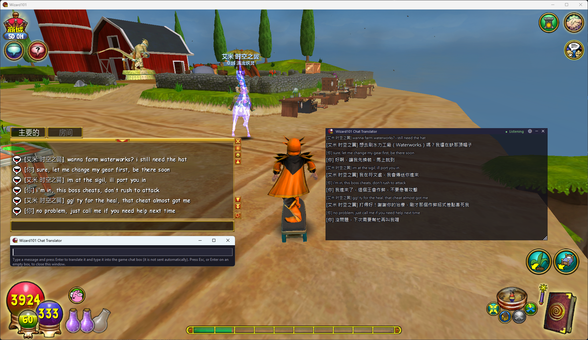
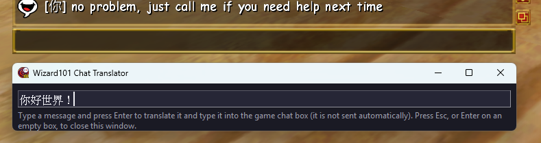
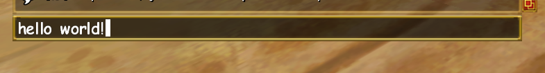
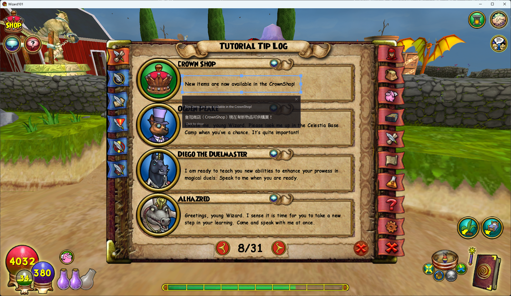

<p align="center">
  
</p>

# Wizard101 對話翻譯助手 (Wizard101 Chat Translator)

[English](README.md) | 繁體中文 | [简体中文](README_ZH-CN.md)

[](https://github.com/GoneTone/wizard101-chat-translator/actions/workflows/ci.yml)
[](https://github.com/GoneTone/wizard101-chat-translator/releases/latest)

Wizard101 對話翻譯助手 —— Wizard101 的聊天對話 AI 翻譯軟體，對話雙向即時翻譯。

**看訊息**：聊天對話出現的每一句都翻成你設定的語言、顯示在疊加視窗裡，譯文上方保留原文，你永遠看得到對方實際說了什麼。

**要發言**：在遊戲裡開啟聊天輸入框，翻譯輸入框就會自動出現。用任何語言打字、按 Enter，英文譯文就會被逐字鍵入遊戲聊天輸入框（遊戲不支援直接貼上）。翻譯內容**不會自動送出**，讓你可以確認，然後按 Enter 發送。

聊天訊息要翻成哪個語言由你決定，設定裡直接填語言名稱（`繁體中文（台灣）`、`日本語`、`Español`…）；對方用什麼語言則由 AI 自動判斷。

聊天內容是直接從遊戲的聊天視窗讀出來，不是從畫面辨識：不會看錯字、不會亂序，他人與自己的發言、誰說的都涵蓋，也不碰任何網路封包。

文章：

- 巴哈姆特：<https://forum.gamer.com.tw/C.php?bsn=17541&snA=288&tnum=1>
- 旋風之音 GoneTone - 網站：<https://blog.reh.tw/archives/4224>

## ⚠ 重要

本軟體會掛入（注入）遊戲程序讀取對話內容，此行為未經 KingsIsle 認可，可能被認定違反 [Wizard101 服務條款](https://www.wizard101.com/game/termsofuse)；依該條款，KingsIsle 可基於任何理由（或無需理由）停權，**請自行斟酌**。

## 下載

下載 `Wizard101ChatTranslator.exe`，放到任意資料夾即可。設定檔 `config.json` 與紀錄檔 `app.log`、`messages.log` 都會存在 exe 同一個資料夾。

<https://github.com/GoneTone/wizard101-chat-translator/releases/latest>

**更新版本**：請先關閉本軟體 —— 點疊加視窗標題列右上角的 ✕ —— 再換檔案。程式執行中，exe 會被 Windows 鎖住、也還掛在遊戲上。關掉後下載新版 `Wizard101ChatTranslator.exe`，覆蓋同一個資料夾裡的舊檔即可，原本的 `config.json` 會照常沿用，服務商、金鑰等設定都不必重填。

**防毒軟體誤判**：本軟體會讀取遊戲聊天記憶體（掛入遊戲程序）並監聽全域熱鍵，行為模式與部分惡意程式相似，可能被防毒軟體標記或直接刪除／隔離，這是誤判，請自行評估風險後把程式加入防毒白名單。

**系統管理員權限**：一般情況（遊戲以一般權限啟動）不需要管理員權限。只有當 Wizard101 本身以**系統管理員**身分執行時，本軟體也必須以系統管理員身分執行（掛入遊戲程序需要對等或更高權限）。權限不足時疊加視窗會顯示「⚠  權限不足」橫幅，關掉本軟體、右鍵選「以系統管理員身分執行」再開一次即可。

## 使用方式

1. 雙擊執行 exe：
   - **翻譯服務尚未設定完成**（第一次執行、或 `config.json` 裡缺模型／金鑰／自架伺服器網址）會跳出**首次設定精靈**：第一步選介面語言，第二步選翻譯服務、填金鑰並測試連線，第三步選目標語言、熱鍵與是否自動呼出翻譯輸入框。存好設定後自動進入主流程。
   - 設定完整後每次啟動都直接進主流程，不會再跳精靈；介面語言仍可隨時在設定視窗（齒輪 ⚙）改，存檔即立即套用，不必重開程式。
2. 開啟 Wizard101 並**登入進遊戲世界內**，疊加視窗才讀得到聊天訊息。
3. 聊天出現訊息 → 疊加視窗顯示**原文 + 目標語言譯文**（最新在最下，可向上滾動看歷史；預設不會依時間淡出，最多保留 200 則，超過會移除最舊；兩者都可在設定的「進階」分頁調整）。
   - **可移動、可縮放**：拖曳頂端標題列移動、拖任一邊或任一角縮放（右下角另有把手；標題列上的 ⚙／─／✕ 按鈕本身仍是按鈕，不觸發縮放）。位置與大小自動存檔。
   - **可選字複製**：在訊息上按住左鍵拖曳選字，可跨多則訊息；拖到訊息區的上下緣之外會自動捲動，選得到畫面外的內容。再按 `Ctrl+C` 或在選取處按右鍵選「複製」即可，複製出來的文字**訊息與訊息之間以空行分隔**。
   - 注意：視窗不滑鼠穿透，它蓋住的那塊區域點擊不會傳到遊戲。
4. 想發言：在遊戲裡開啟聊天輸入框 → 翻譯輸入框自動出現在遊戲聊天輸入框正下方、與它同寬（每次開啟聊天輸入框時重新貼齊）→ 輸入訊息（任何語言）→ Enter → 軟體切回遊戲、把翻好的英文**逐字自動鍵入**聊天輸入框 → 自己檢查後按 Enter 送出。
   - 若把翻譯輸入框關掉了，或在設定內關閉了自動呼出（`auto_show_input`），可以按 `Ctrl+Space`（預設）叫它出來：遊戲聊天輸入框開著就出現在它底下，沒開就出現在滑鼠游標處。熱鍵只在遊戲視窗位於前景時生效，切到其他程式不會誤觸。
   - 譯文超過遊戲聊天輸入框的 80 字上限時不會鍵入，翻譯輸入框會提示字數、留著原文讓你刪減或分段後重送。
   - 打字到一半遊戲把聊天輸入框關了，翻譯輸入框會跟著收起，但尚未送出的文字會留著，下次呼出時還原；自己按 Esc 或 ✕ 關閉的才會清掉。
   - 譯文自動鍵入進遊戲時漏字／太快 → 開啟設定視窗（⚙），在「進階」分頁調大「鍵入延遲（秒）」。
   - 打字期間游標要停在遊戲聊天輸入框，別去點別的視窗。
5. 想改設定（服務商、金鑰、目標語言、熱鍵…）時，點疊加視窗標題列的齒輪（⚙）開啟設定視窗，存檔即套用，不必重開程式（只有「進階」分頁的「遊戲路徑」要下次啟動才生效）。
6. 要結束程式時，點疊加視窗標題列右上角的 ✕（會先解除遊戲掛入再退出）。
7. 每次啟動會自動檢查 GitHub 上有沒有新版本，有的話疊加視窗會多出一條藍色橫幅（點橫幅開下載頁，點右側 ✕ 關掉這次提醒）；也可以在設定視窗的「關於」分頁手動檢查更新、查看專案連結與紀錄檔所在資料夾。

## 功能與特色

- **看得懂別人在說什麼**：聊天每一句都即時翻成你的語言，原文保留在譯文上方；訊息一次湧進來也跟得上
- **用自己的語言發言**：開啟遊戲聊天輸入框，翻譯輸入框就自動出現；打完按 Enter，英文譯文自動鍵入聊天框，要不要送出由你決定
- **不會看錯字、不會漏訊息**：直接讀遊戲的聊天內容，不是辨識畫面，他人與自己的發言都涵蓋
- **要翻成什麼語言你自己填**：直接填語言名稱（`繁體中文（台灣）`、`日本語`、`Español`…），對方用什麼語言則由 AI 自動判斷
- **選你要用的 AI**：OpenAI（ChatGPT）、Anthropic（Claude），或自己架的 OpenAI 相容服務；每家各存一份設定，換來換去不必重填金鑰
- **系統訊息想不想看都行**：掉寶、經驗、升等廣播之類的預設不翻，需要時在設定開啟
- **視窗擺順手就不用再管**：拖曳移動、拉邊角縮放、調低不透明度、不看時縮成小泡泡，位置與大小都記住，下次啟動還在原地
- **想留下的內容可以複製**：在訊息上拖曳選字，可跨多則訊息，`Ctrl+C` 或右鍵複製
- **設定隨時能改**：首次執行有精靈帶你設定；之後點齒輪（⚙）改，存檔立刻生效，不必重開程式
- **被硬砍或當機也能接著用**：正常結束會自己解除掛入；萬一被強制結束，下次啟動會先清掉上次的殘留再重新接上，不必重開遊戲
- **介面多語言、自動檢查更新**：首次執行依 Windows 系統語言自動判定；有新版會在疊加視窗上提醒你

## 疑難排解

- **顯示「權限不足」橫幅**：遊戲以系統管理員身分執行，軟體掛不進去。關掉軟體，改以系統管理員身分啟動（從原始碼執行時，改以系統管理員身分開終端）。
- **顯示「遊戲版本不相容」橫幅**：本軟體靠固定的記憶體特徵（pattern）找到聊天控件，遊戲改版可能讓這組特徵失效。先把**遊戲與本軟體**都更新到最新版；若兩者都已是最新仍出現這條橫幅，代表本軟體尚未跟上這個遊戲版本，只能等新版釋出（可在設定視窗的「關於」分頁檢查更新）。這種情況下不會有任何東西被寫進遊戲，放著不管也不會有副作用。
- **狀態停在「連線遊戲中…」或顯示「遊戲未就緒／連線中斷」**：確認遊戲已啟動並登入進遊戲世界內。
- **自動鍵入譯文時遊戲漏字**：在設定視窗（⚙）的「進階」分頁調大「鍵入延遲（秒）」，並確認打字期間游標停在遊戲聊天輸入框。

## 截圖

疊加視窗浮在執行中的遊戲畫面上 —— 每則聊天的原文都留在譯文上方：



在遊戲裡打開聊天輸入框，翻譯輸入框就會自己跳出來，用任何語言輸入都可以：



英文譯文被逐字打進遊戲的聊天輸入框 —— 要不要按 Enter 送出，由你決定：



設定視窗：翻譯服務、API 金鑰、目標語言與快捷鍵，儲存後立即生效、不必重啟：



## 已知限制

- 遊戲聊天白名單：非白名單英文詞可能被遊戲自動過濾，任何翻譯軟體都繞不過。
- 譯文不會瞬間出現：預設每 0.4 秒掃一次聊天（「進階」分頁可調），再等翻譯服務回應才顯示，慢多少主要看你選的服務商與模型。
- 玩家對話不快取，每一則都會實際送一次翻譯（也就是每則都算 API 費用）。原因有二：玩家講的話幾乎不會一字不差地重複，快取幾乎不會命中；而且每則翻譯都會帶上前幾則對話當上下文，同一句話在不同脈絡下本來就該翻得不一樣，硬套舊譯文反而會翻錯。只有句型固定的系統訊息才快取。
- 依賴固定的記憶體特徵（pattern）：遊戲改版後 pattern 可能失效（掛入時報 `PatternFailed`，或 hook 掛上了卻不被觸發），需等支援跟進才會恢復；從原始碼執行時，是等收訊用的相依套件更新後重跑 `uv sync`。兩種情形疊加視窗都顯示「⚠  遊戲版本不相容」橫幅，與「遊戲沒開」分得開。
- 掛入遊戲與全域熱鍵（keyboard 套件）只在遊戲以系統管理員身分執行時需要同樣提權（完整性等級要對等），一般情況不必；權限不足時橫幅會直接指出解法。

## 開發

以下為原始碼開發、除錯、打包用的流程。

### 前置需求

- Windows
- [uv](https://docs.astral.sh/uv/) —— Python 版本由 `.python-version` 釘住，`uv sync` 會自動下載對應版本，本機與 CI 一致

### 安裝

1. `uv sync` —— 建立 `.venv` 並依 `pyproject.toml` 裝好所有相依（含收訊用的 wizwalker；已於 `[tool.uv.sources]` 指向有跟進最新 client pattern 的 [LaurenzNotHere fork](https://codeberg.org/LaurenzNotHere/wizwalker)，官方 PyPI 版 pattern 過舊、對不上現行 client）。
2. `uv run run.py` —— 第一次執行會跑首次設定精靈（選服務商、填金鑰或自架伺服器網址、測試連線），設定寫進專案根目錄的 `config.json`（不進版控）。

> 遊戲改版導致掛入報 `PatternFailed` 時，更新 fork 後重跑 `uv sync`（或 `uv lock --upgrade-package wizwalker`）取得新 pattern。

### 從原始碼執行

1. 開啟並登入 Wizard101 到遊戲世界內。
2. `uv run run.py`（等同 `uv run python -m src.main`）。
3. 操作方式與[使用方式](#使用方式)一節相同；出現橫幅時見[疑難排解](#疑難排解)。

### 新增介面語言

介面語言清單由 `src/i18n/` 底下的語言檔掃描而來，**新增一個語言不必改任何程式碼**：

1. 複製 `src/i18n/zh-TW.json`（來源語言，key 最齊全）成 `src/i18n/<locale 代碼>.json`，例如 `ja-JP.json`，把每一則文案翻好。檔名採 Crowdin 的 locale 代碼（`en-US`／`zh-TW`／`ja-JP`），也就是 `crowdin.yml` 寫入譯文的路徑，從 Crowdin 下載的檔案直接就位。
2. 檔案開頭這幾個欄位是該語言自己的資料，不是給譯者翻的文案：

   | 欄位 | 說明 |
   |------|------|
   | `language.name` | 該語言的自稱（endonym），例如 `日本語`。語言選單在任何介面語言下都顯示它、不翻譯；也是這個語言的使用者首次執行時預設的 `target_language` |
   | `language.font` | 介面字族，例如 `Yu Gothic UI`。沒宣告則退回 `Segoe UI` |
   | `language.translators` | 這份譯文的譯者掛名，例如 `[GoneTone](https://github.com/GoneTone)、Someone`。可用 `[文字](網址)` 加行內連結（只接受 `http`／`https`）。留空＝不顯示；設定視窗的語言下拉底下、首次設定精靈的語言步驟與「關於」分頁都會顯示它 |

3. `uv run pytest` —— `tests/test_i18n.py` 會檢查新語言檔的 key 與來源語言一致、變數（`{app}` 等）沒被翻壞、metadata 有填。

首次執行時系統語言要對到哪一份語言檔，是拿檔名交給 CLDR 的語言距離資料（[`langcodes`](https://github.com/georgkrause/langcodes)）判斷的，語言檔不必宣告任何東西：`zh-HK` 的系統會落到 `zh-TW`、`en-GB` 落到 `en-US`，若哪天同時有 `pt-BR` 與 `pt-PT`，`pt-MZ` 的系統會選 `pt-PT`。沒有夠接近的語言檔時退 `en-US`。

打包時 `build.spec` 以 `src/i18n/*.json` 收錄，新檔會自動被帶進 exe。

### 檢查

```
uv run ruff check src tests   # lint：未用的 import、未定義名稱、import 排序（規則見 pyproject.toml）
uv run pytest                 # 單元測試（預設 4 個 worker 平行跑；要序列跑加 -n 0）
```

推上 GitHub 後 CI（`.github/workflows/ci.yml`）會在 Windows runner 上跑同樣的 lint 與測試。

### 打包（exe）

```
uv run pyinstaller build.spec --noconfirm
```

產物在 `dist/Wizard101ChatTranslator.exe`，單一 windowed exe（無主控台黑窗）。分發時只需這個 exe，`config.json`、`app.log` 與 `messages.log` 會在使用者第一次執行時自動建立在 exe 同一個資料夾（見[下載](#下載)）。

### 紀錄檔

兩份紀錄都以「每次啟動一段」分段、只保留近 7 天，每行開頭是 UTC＋0 時戳：

- `app.log`：程式診斷輸出（掛入、翻譯請求、設定套用、例外等）。
- `messages.log`：收訊端讀到的**原始**聊天內容，不做任何清理與過濾（`RAW` 為含標記的原文、含系統訊息，只排除遊戲自己灌進聊天控件的 `[WARN]`／`[ERRO]`／`[DBGM]` 之類的除錯行；`OUT` 為實際送去翻譯的行）。訊息漏翻／重複翻譯之類的問題請一併附上這份。

## 圖示

程式圖示（`src/assets/icon.ico`）改作自 Wizard101 的遊戲圖示，右上角疊上「文A」翻譯徽章，exe 與所有視窗共用同一份。底圖著作權屬 KingsIsle Entertainment，本專案與其並無隸屬關係。
